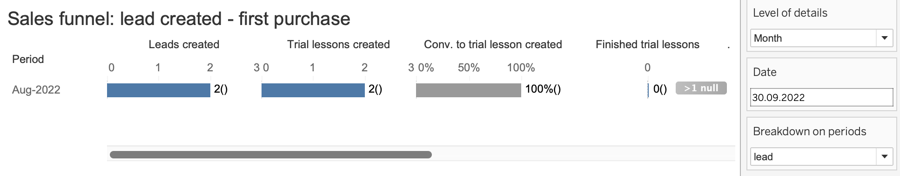
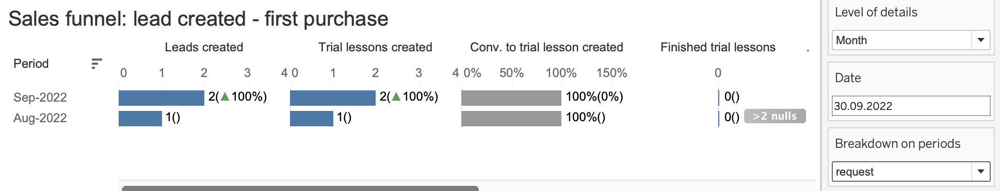
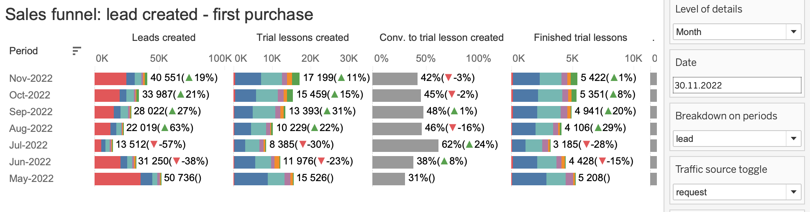

dHello everyone!

We are pleased to announce a new funnel: lead - request (registration for an introductory lesson) - successful introductory lesson (SIL) - first purchase.
What's included in this description:

 * Overall report structure
 * What is a lead
 * "Breakdown on periods” filter
 * "Traffic source toggle” filter
 * “Enrolment type: by user / by call center” filter
 * "Lead type: new / current” filter
 * Logic of matching leads to requests
 * Examples of funnel operation
 * Notes

**Overall Report Structure**

This report contains several dashboards in different segments:

 * General funnel: an overall view of the funnel with all the filters listed below.
 * Funnel by school types: primary, middle, high, undefined.
 * Funnel by traffic types: internal, external, organic, "floctory”, telemarketing, undefined.
 * Funnel by lead types: The funnel segmented by how the introductory session was booked: by user or via the call center, and whether it was the first booking or repeated. (isn’t mentioned on github)
 * Funnel by utm tags of leads: features the "traffic source" segment, as well as filters that allow for the selection of specific UTM tags collected at the lead creation stage. (isn’t mentioned on github)
 * Funnel by utm tags of requests: Features the "traffic source" segment, as well as filters that allow for the selection of specific UTM tags collected at the request creation stage. (isn’t mentioned on github)
 * Funnel by traffic channels: A dashboard with a more detailed breakdown of traffic sources. (isn’t mentioned on github)

**What is a Lead?**

A lead is a user's left phone number on one of our landings or an unfinished process of self-registration by the user for a trial lesson. 
This funnel visually resembles the existing funnel (request - initial registration - first purchase) but has many nuances that differentiate them. Below is a description of these nuances:

**"Breakdown on periods" Filter**

Firstly, note the "Breakdown on periods" filter, which includes two values: lead and request. Choosing "lead" bases the funnel on the lead creation date, while "request" uses the request creation date.

This functionality is crucial for cases where a request is made without a lead, for instance, when a user registers for a course through the "flocktory" channel, bypassing the lead stage. In such situations, we artificially set the lead creation date based on the request creation date to accurately display the initial funnel stages. Hence, the lead and request dates might coincide or significantly differ in some cases. Depending on the report's purpose, you can switch between two cohort calculation logics: cohort from the lead date or cohort from the request date.

Example:
Let's examine the impact of the "Breakdown on periods" filter using student 643 as an example.

As we see in the "lead_creation_date" column, there is only one unique date - August 31, 2022. The "trial_lesson_creation_date" column shows a greater variety of dates. It's also important to note the "subject_name" column, which includes two subjects: math_middle_school and english_middle_school. 

If we select "lead" in the "Breakdown on Periods“ filter, Tableau will construct a funnel based on the lead creation date. Since there are two different subjects, we can see 2 leads created at the "Leads Created" stage, one for each subject. In the "trial_lesson_creation_date" column, we can also see 2 because a trial lesson was created for each subject. We see exactly 2 created trial lessons, no more, because to calculate a fair conversion, we need to consolidate enrollements within each student, subject, and lead/request creation date (depending on what is selected in the "Breakdown on Periods" filter).

If "request" is selected in the "Breakdown on periods" filter, Tableau will generate a chart based on the request creation date. Since there's a math request made in August, a second bar for August 2022 will appear on the chart. Additionally, english and math requests created in September lead to two requests counted for September, with all other requests being deduplicated according to the previously mentioned logic. 

**"Traffic source toggle” filter**

Our database collects utm tag information to determine which channel the user came to us from. We log this information at two stages: 
- at the stage when a user leaves a lead on a landing page
- at the stage when a user enrolls for the first trial lesson, i.e. actually registers on Uchi.Doma web site. 

Utm tags at these stages may be the same, or they may be different. Depending on the task, you may need information about the channel of attraction both at the lead stage and at the requester stage. This filter allows you to choose what will be the basis for determining the channel of traffic attraction. 

Examples of distinction: 

- A user registered and created his first request in 2020, following a link from the Uchi.ru mailing list. In 2022 this user returned as a lead from the CPA channel. This user's requests will always be related to the mailing channel, but leads will change their utm tags.
- In case we collected a lead without information about the source (without utm-tags), but the user was already registered with us and we have information from which channel the registration was made, we will use this channel to identify the lead. 
- In case you have selected the "request" value in the "Traffic source toggle” filter, it is normal that at the “lead” level you will see a large share of traffic with the "undefined" category, because users who have left only a lead but have not created a request, by definition, cannot have information about the traffic source at the stage of creating a request. This situation is illustrated on the screenshot. 

Also a distinctive feature from the dashboard with the "quest - purchase" funnel is that the "flocktory" channel of attraction is highlighted separately along with the categories: 
- internal - mailings on the base of uchi.ru 
- external - external traffic
- orgainc - direct access to our web pages or users without tags 
- undefined - traffic that could not be categorized (often these are new utm-tags that we have not yet added to our scripts).

“Enrolment type: by user / by call center” filter

Today a user can sign up for a trial lesson by themself or they can leave their contact details and a call center operator will call them back and sign them up for a trial lesson. Before summer 2020 users signed up for a trial lesson only by themself. After that we reorganised users trial lessons sign up flow and most of landings got the only way to make a trial lesson sign up - via call center operators. The filter ‘lead type: new/current’ allows you to separate users into those who signed up on their own and those who was signed up by a call center.    

**"Lead type: new / current” filter**

From the name it is clear that the filter divides users into those who leave a lead for the first time and those who have previously left either a lead or created a request. 

The filter implies the following values: 

* by_user: new - a user made an enrolment for a trial lesson by themself and did it for the very first time (regardless of a school subject)
* by_user: current - a user made a trial lesson enrolment by themself but did it not for the first time (regardless of a school subject)
* by_operator: funnel_page_new_lead - the first time a user left a contact information on the landing page, that implies enrolment only via a call center operator. This can be the first time within a specific school subject (in case a lead has a school subject affiliation) or the first time in general, with no subject affiliation.
* by_operator: not_funnel_page_new_lead - the first time a user left a contact information on the landing page, that implies enrolment by user itself. This can be the first time within a specific school subject (in case a lead has a school subject affiliation) or the first time in general, with no subject affiliation.
* by_operator: rescheduled_lead - a user left a contact information by did it not for the first time. 
* by_operator: other - other cases that do not covered by the above criteria. 

**Logic of matching a lead to a request**

Joining a lead to a request is somewhat counterintuitive: the script first creates the second stage of the funnel (request) and then joins the first stage (lead) to it. This joining occurs according to the following parameters: 

- search for the nearest lead regardless of a school subject for which it was created: it allows us correctly calculate cases when a user had created a lead by one school subject but finally he got enrolment for a trial lesson by another school subject or even got enrolment on several trial lessons by other school subjects. 
- looking within two weeks before the creation of a trial lesson: this time limit is necessary to avoid pulling leads that the user may have left a long time ago.  

**Examples of sales funnel operation**

 Let's look at the most common situations with our users from a sales funnel perspective. 

Example 1: 

A user left contact information (created a lead) on a math landing page on 28 of September 2022. Call center operator contacted with the user and made an enrolment for a math trial lesson on 1st of October 2022. The user didn’t show up for the lesson. 

In this case, the funnel will look as follows: 

Example 2: 

The user from the first example created another lead on October 12 on the "computer literacy" landing page. A call center manager signed him up for a trial lesson on October 14, the user completed it successfully and made his first purchase. 

Taking into account all the data on this user, the funnel will look as follows:

Example 3:

On October 13 a user created a lead for Math and English. On October 14 he created another lead and again for English. On October 15 he received a call from a call center manager and was enrolled for Math, English and Programming trial lessons. All trial lessons are scheduled for October 17, and the user successfully completed all three trial lessons but didn't buy anything. 

The funnel would look as follows: 

Note: you may be confused by the number 3 at the "Leads created" stage, because the user created a lead for Math and 2 times for English, which are de-duplicated in 1. And in theory, the "Leads created" column should have a value of 2. However, we remember that first we create requests, and we created them for three subjects, and only then we look for their correspondence in the leads, and if we don't find them, we build them artificially. For English and Math we found the leads, because they really exist, but for Programming there was no created lead, and we created it by ourselves not to get a funnel like: 2-3-3-0. 

Example 4: 

A user created a lead on the "English subject” landing page on October 2. Without waiting for a callback from the call center, he did it again. And then 8 more times. The next day he got a call from a call center operator and signed up for an English subject trial lesson on October 5. The user showed up for the lesson and then made a purchase. 

The funnel would look like this: 

Note: all 10 leads are de-duplicated into 1 because they were created on the same subject during the same month

Reasons for the difference with the google doc

**Notes**

Additional logic has been added to the dashboard to ensure that the funnel reflects the actual conversion to a completed trial lesson in the current month. 

Previos dashboard edition showed the following result: 

If you take a look at the column "Conversion to finished trial lessons", you would think that in February 23, the conversion to finished trial lessons dropped a lot (-8 percentage points) compared to January. But in fact in the formula for calculating this conversion rate ( finished trial lessons / created trial lessons) all created trial lessons are taken into account, even those that could not physically take place yet, because they are scheduled for dates later than February 17 (this date is selected in the dashboard filter in the screenshot).

The picture after adding extra logic in the dashboard: 

We have changed the logic of calculating conversion to a finished trial lessons by adding an adjustment for the start date of the trial lesson. If the start date of a trial lesson is greater than the selected date in the dashboard filter (in the case of the example on the screen - February 17, 2023), then we exclude such a request from the "Trial lessons created" column. This way we get the currently relevant conversion to a finished trial lesson. However, to keep the funnel visually clear, we had to make some compromise: if we look at the dashboard and try to check the correctness of the conversion rate from a created tiral lesson to a finished trial lesson, we need to divide 2656 (number of completed trial lessons) by 8000 (number of created trial lessons), and then we get a conversion rate of 33%, which does not correspond to the value on the screenshot. We can't afford to make corrections to the absolute values of created and completed trial lessons in order not to distort the picture, so we had two options to implement the new logic: either add some additional columns to the chart, which would reflect the absolute values corrected for the lesson start date and the date selected in the filter, or hide it all under the hood. We decided that the readability of the chart is a priority, so we didn't add new columns, but added this description, which can explain this inconsistency with conversion.     
